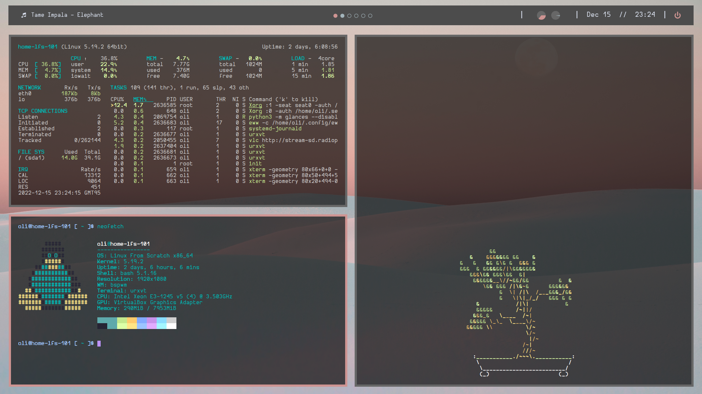

# lfs_dotfiles

## Overview

Pretty minimal dotfiles for an LFS build, with _bspwm_ &amp; Eww

---

<br>

## Resources

#### Linux From Scratch

 - [LFS 11.2](https://www.linuxfromscratch.org/lfs/view/stable-systemd/)
 - [BLFS 11.2](https://www.linuxfromscratch.org/blfs/view/stable-systemd/)


#### _bspwm_

- [baskerville/bspwm](https://github.com/baskerville/bspwm) - a tiling window manager 
- Adapted from [shapzo/Dotfiles_BSPwm](https://github.com/shapzo/Dotfiles_BSPwm)' dotfiles


#### Eww

- [elkowar/eww](https://github.com/elkowar/eww) - a standalone widget system for window managers
- Adapted from [okklol/eww-bar](https://github.com/okklol/eww-bar)' dotfiles
- ```scripts/cpu.sh``` is credited to _adi1090x_

#### Font

- [Hurmit Nerd Font](https://github.com/shapzo/Dotfiles_BSPwm/tree/352f2e75fa0a0733f46cf505bb8ab2725b568962/Fonts/Hermit)

#### Wallpaper

 - [white sand photo](https://unsplash.com/photos/RsRTIofe0HE) by [John Fowler on Unsplash](https://unsplash.com/@wildhoney)


 ---

<br>

<br>

Along with the tools above, the screenshot below displays:

- [nicolargo/glances](https://github.com/nicolargo/glances) - top/htop alternative
- [dylanaraps/neofetch](https://github.com/dylanaraps/neofetch) - sysinfo utility
- [jallbrit/cbonsai](https://gitlab.com/jallbrit/cbonsai) - cli bonsai tree

<br>


